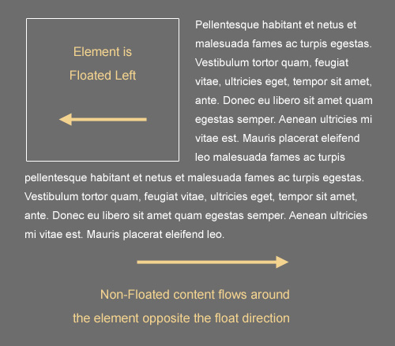

Have you ever wondered how to dynamically postion elements in the browser? If you have you would most definitely beinifit from using floats. 
Most newcommers to CSS are confused and scared away by floating elements. It can be quite tricky to understand what is going on behind the scenes.
I will try to help show you "The Man Behind the Curtain", as we explore the world of floats together. 

<!--more-->

### History

The origin of the float came from print media. I am sure that yo have seen this. It is most use full when text needed to wrap around a picture. The picture is usually in the top left hand corner and the article will come down the right side and then below the picutre it will be the full width of the section. 

HTML Code
